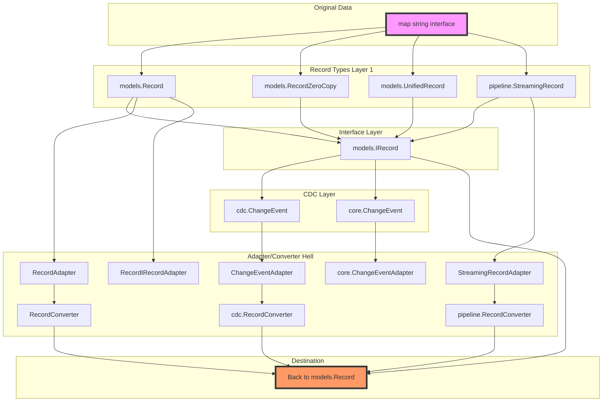

# Feature Proliferation Visualization

## Record Type Proliferation Map



## Memory Pool Proliferation

```
┌─────────────────────────────────────────────────────────────┐
│                     Memory Allocation                         │
├─────────────────────────────────────────────────────────────┤
│                                                               │
│  ┌─────────┐  ┌─────────┐  ┌─────────┐  ┌─────────┐        │
│  │ Pool 1  │  │ Pool 2  │  │ Pool 3  │  │ Pool 4  │        │
│  │pkg/pool │  │ models  │  │optimize │  │sync.Pool│        │
│  └────┬────┘  └────┬────┘  └────┬────┘  └────┬────┘        │
│       │            │            │            │               │
│       ▼            ▼            ▼            ▼               │
│    Records     Records      Records      Records            │
│                                                               │
│  Problem: 4 different pools managing the same objects!       │
└─────────────────────────────────────────────────────────────┘
```

## Configuration Chaos

```
User Configuration Journey:

1. Start with CSV Source
   └─> CSVSourceConfig { BatchSize: 1000 }

2. Configure Pipeline  
   └─> PipelineConfig { MaxBatchSize: 1000 }  // Same thing!

3. Configure Destination
   └─> SnowflakeConfig { BulkSize: 1000 }    // Same thing!

4. Configure Optimization
   └─> OptimizationConfig { ChunkSize: 1000 } // Same thing!

Result: User sets same value 4 times with different names!
```

## The Real Cost

```
Simple Data Flow:
CSV File → Read → Process → Write → Snowflake

What Actually Happens:
CSV File 
  → models.Record (allocation)
  → StreamingRecord (wrapper allocation)  
  → IRecord (interface allocation)
  → Adapter (allocation)
  → Converter (allocation)
  → models.Record again (allocation)
  → Snowflake

6 unnecessary allocations per record!
At 1M records/sec goal = 6M unnecessary allocations/sec
```

## Complexity Growth Over Time

```
         Complexity
            ^
        100 |                                    ████ (Now)
            |                                ████
            |                            ████
         75 |                        ████
            |                    ████
            |                ████
         50 |            ████
            |        ████
            |    ████
         25 | ████
            |
          0 +-----|-----|-----|-----|-----|-----|
              Jan   Feb   Mar   Apr   May   Jun
              2024                          2024

Legend: █ = Features added without removing old ones
```

## The Solution

### Before (15+ types):
```
Record Types: [Record, IRecord, RecordZeroCopy, UnifiedRecord, 
               StreamingRecord, ChangeEvent(x2), RecordBatch,
               + 8 adapters + 2 converters + 4 wrappers]
```

### After (1 type):
```
Record Type: [Record]
```

### Performance Impact:
- **Before**: 420K records/sec (with overhead)
- **After**: 550K-600K records/sec (estimated)
- **Gain**: 30-40% performance improvement just from cleanup!